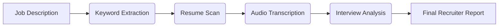

# 🤖 AI Recruiter Assistant — Multi-Agent Automation

An intelligent recruitment evaluation system leveraging multiple specialized AI tools.

---

## 🚀 What this project does

This multi-agent pipeline automates the full candidate screening workflow:

1️⃣ **Extract keywords** from the job description  
2️⃣ **Scan PDF resumes** for matching skills  
3️⃣ **Transcribe the interview** audio using Whisper  
4️⃣ **Analyze interview relevance** vs job requirements  
5️⃣ **Generate a structured recruiter-friendly report**

---

## 🧠 Key Technology

- Multi-Agent System with OpenAI GPT models
- Resume parsing from PDFs (PyMuPDF)
- Audio transcription with Whisper
- HR relevance evaluation
- Markdown report generation

---

## 📂 Project Structure

```
📁 audio_interview/  → MP3 interview files
📁 resumes/          → Candidate resumes in PDF
📁 reports/          → Evaluation outputs

```

---

## 🧩 Workflow Diagram



---

## 📦 Requirements

- Python 3.10+
- OpenAI Python SDK
- PyMuPDF (fitz)
- Whisper model access
- Async execution support

---

## ▶️ How to Run

Ensure your environment includes:

```
OPENAI_API_KEY=your_key_here
```

Place resumes in `resumes/` and interview MP3 in `audio_interview/`.

---

## 📌 Output Example

- Extracted skills list
- Resume match evidence (snippets + pages)
- Interview strengths & missing skills
- Overall alignment notes

---

### 🚀 Status: MVP Functional

Future enhancements:
- Scoring system per candidate
- UI for uploads (Streamlit/Gradio)
- Export to PDF

---

> An automated AI-powered assistant to help recruiters make faster and smarter hiring decisions.